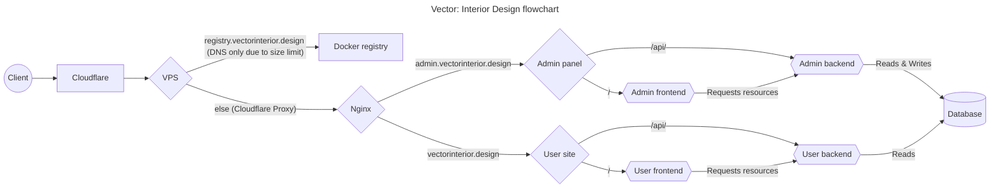

# Vector: Interior Design

This is the repository for the **Vector: Interior Design** porfolio website.

# Architecture

The project is modularized into a `docker-compose` setup with 7 services:

- [database](/database/)
- [admin-backend](/backend/src/admin/)
- [user-backend](/backend/src/user/)
- [nginx](/nginx/)
- [admin-frontend](/frontend/admin/)
- [user-frontend](/frontend/user/)
- [tests](/backend/tests/)

Click each one to go into depth about the inner workings of each. Here's a graph showing the general flow of the services.

# Environment

## Variables

| Variable           | Description                                                                                                               | Default    | Database | Admin-backend | User-backend | nginx | Admin-frontend | User-frontend | Tests |
| ------------------ | ------------------------------------------------------------------------------------------------------------------------- | ---------- | -------- | ------------- | ------------ | ----- | -------------- | ------------- | ----- |
| `DEV_MODE`         | Enables developer tools in multiple containers                                                                            | 1          |          | ✓             | ✓            | ✓     |                |               |       |
| `DATABASE_NAME`    | The name of the database that stores all the data                                                                         | postgres   | ✓        | ✓             | ✓            |       |                |               | ✓     |
| `DATABASE_PORT`    | The port the database will run on                                                                                         | 5432       | ✓        | ✓             | ✓            |       |                |               | ✓     |
| `ADMIN_USERNAME`   | The database username for the admin backend                                                                               | admin      | ✓        | ✓             |              |       |                |               |       |
| `ADMIN_URL`        | The url for admin site (**Without protocol or slashes**). Used reverse proxy.                                             | *Required* |          |               |              | ✓     |                |               |       |
| `ADMIN_IMAGES_URL` | The url to access images from the admin (**Include trailing slash**). **Recommended to use protocol-relative URL** panel. | *Required* |          | ✓             |              |       |                |               |       |
| `ADMIN_API_PATH`   | The path relative to `ADMIN_URL` to access the API. **Include slashes before and after**                                  | *Required* |          |               |              | ✓     | ✓              |               |       |
| `USER_USERNAME`    | The database username for the user backend.                                                                               | frontend   | ✓        |               | ✓            |       |                |               |       |
| `USER_URL`         | The url for user frontend **(without protocol or slashes)**. Used reverse proxy                                           | *Required* |          |               |              | ✓     | ✓              |               |       |
| `USER_IMAGES_URL`  | The url to access images from the user frontend **(Include protocol and slashes)**.                                       | *Required* |          |               |              |       |                | ✓             |       |
| `USER_API_PATH`    | The path relative to `USER_URL` to access the API. ***Include slashes before and after**                                  | *Required* |          |               |              | ✓     |                | ✓             |

## Secrets

Secrets must be added to `./secrets/<secret>` relative to the `docker-compose` directory. The secrets are the following:

- `admin_password.txt`: The password for the admin database user.
- `user_password.txt`: The password for the user database user.
- `postgres_password.txt`: The password for the root user in postgres (postgres).
- `nginx_forward_secret.txt`: A secret required by the Sanic backend to trust nginx and forward the protocol

# Development

Run `docker-compose --profile -f docker-compose.yml -f docker-compose.prod.yml prod up` (or `--profile tests` to run tests). This command launches the application in production mode. To run the hmr for both backend and frontend add the options `-f docker-compose.yml -f docker-compose.dev.yml`.

# Deployment

Push all changes to the main branch. A github action is setup to build the docker image, push it to the VPS and deploy the application.

## Registry

Since the easiest way to update a docker container is to upload the image to a registry and all registries charge for the storage than it is required for this project I have setup a self hosted registry in the same VPS that's running the website at the url `REGISTRY_URL` (**without protocol or slashes**) env variable. All you have to do to create a new version is push the changes to the master branch.

To deploy the registry go to the [Dockerfile folder](/registry/Dockerfile), run `docker build -t vector-registry . --target base` and deploy it with `docker run --mount type=bind,src=${PWD}/password,dst=/auth/htpasswd -p 127.0.0.1:5000:5000 -v /var/lib/registry --name vector-registry vector-registry`. The htpasswd file must contain the username and password in the following format `username:password-bcrypt-hash`. **Important to note that it requires the hash not the actual password**.

All services are tagged with `service:latest` and the production [docker-compose.prod.yml](/docker-compose.prod.yml) pulls from this image so all commits will update the service. To keep some backups just in case an additional tag is added to every service which are defined by the `ADMIN_BACKEND_TAG`, `USER_BACKEND_TAG`, `ADMIN_FRONTEND_TAG`, `USER_FRONTEND_TAG`, `DATABASE_TAG`, and `NGINX_TAG` environment variables respectively. Recommended to use Semantic Versioning but anything will do.

Since uploading images can get storage heavy really quick I have setup a helper script that **will only keep the latests 5 versions of an image**. To run it go to [the script](/registry/cleanup/registry.py) and run `python registry.py -l "username:password" -r REGISTRY_URL --delete --num 5 --keep-tags "latest"`.

All this is handled by the Github Action so there's no need to manually trigger. This documentation is here just in case.
