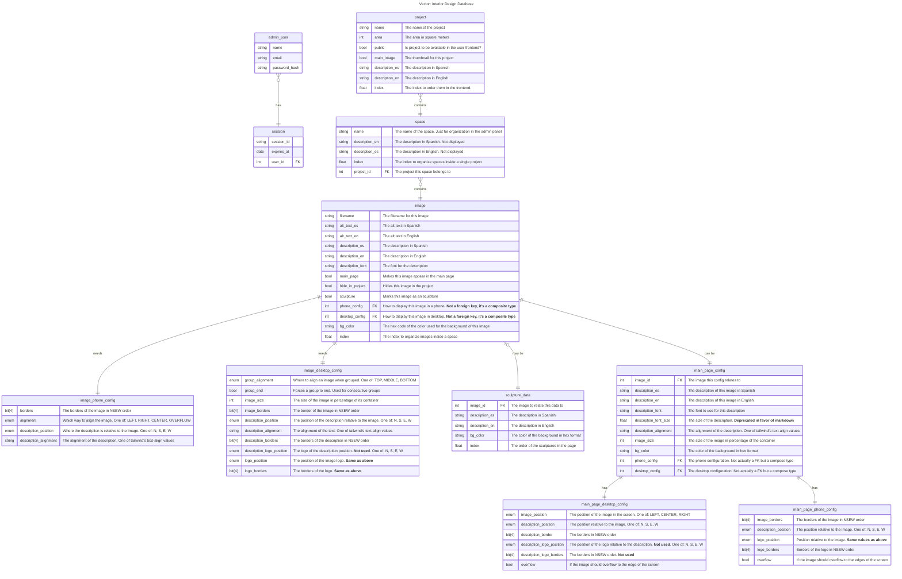

# Database

This is the main postgresql database that holds all data related to the website. It uses the following initialization steps:

1. Creates two users for admin and user backends. Identified respectively by `ADMIN_USERNAME` and `ADMIN_PASSWORD` and `USER_USERNAME` and `USER_PASSWORD`.
2. Manually running `python migrations.py migrate` from within the [cli directory in the admin-backend](/backend/src/admin/cli/) to put everything up to date.

# Tables

**Note**: ids are being skipped since they are present in every table.



# Indexing

Ordering elements isn't as stray forward as it seems. If it's done in a sequential order the following issue arises:

```
1
2
3
4

1
3
2
4
```

In this case moving position two to the second position means having to update all indexes above it. Meaning it has to update 3, 2, and 4. Worse case scenario this becomes an O(n) operation.

To solve this float indexing is implemented. Where to move an item only that item needs to be updated by setting its value to the average of the index of the elements before and after. For example:

```
1.0
2.0
3.0
4.0

1.0
3.0
2.0
4.0

1.0
1.5
2.0
4.0
```
This pretty much makes it an O(1) operation since only one value needs to be updated. 

In practice in the frontend it's implemented by checking all elements and updating them only if their index has changed since it's really cumbersome to keep track of what element moved where turning it again into an O(n) operation but what you gonna do? ^_~ 

